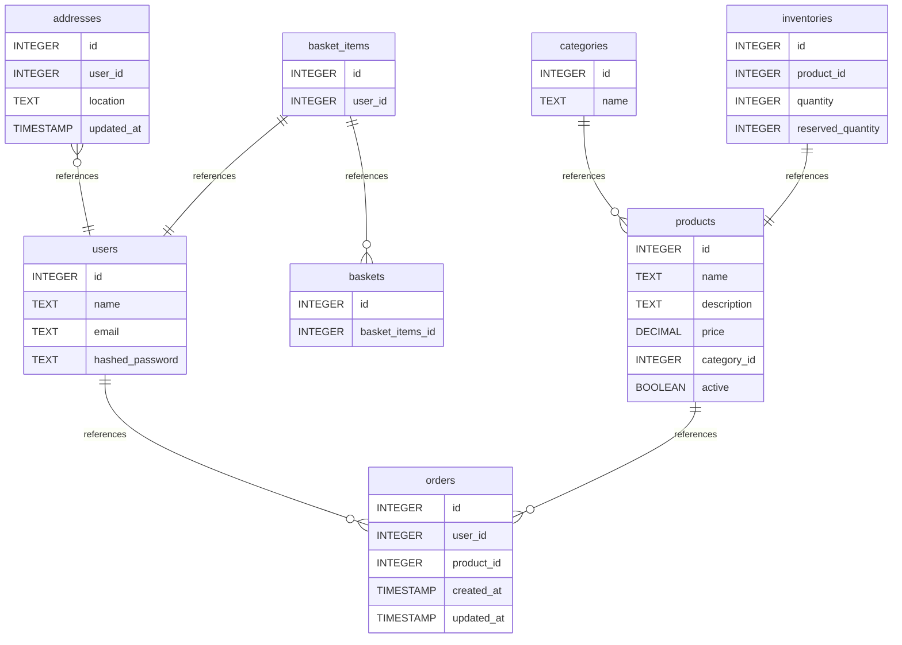

# e-commers api  documentation
## Summary

- [Introduction](#introduction)
- [Database Type](#database-type)
- [Table Structure](#table-structure)
	- [users](#users)
	- [addresses](#addresses)
	- [products](#products)
	- [categories](#categories)
	- [orders](#orders)
	- [basket_items](#basket_items)
	- [baskets](#baskets)
	- [inventories](#inventories)
- [Relationships](#relationships)
- [Database Diagram](#database-diagram)

## Introduction

## Database type

- **Database system:** PostgreSQL
## Table structure

### users

| Name                | Type    | Settings                       | References         | Note |
| ------------------- | ------- | ------------------------------ | ------------------ | ---- |
| **id**              | INTEGER | 🔑 PK, not null, autoincrement | fk_users_id_orders |      |
| **name**            | TEXT    | null                           |                    |      |
| **email**           | TEXT    | null                           |                    |      |
| **hashed_password** | TEXT    | null                           |                    |      | 

### addresses

| Name           | Type      | Settings                       | References                 | Note |
| -------------- | --------- | ------------------------------ | -------------------------- | ---- |
| **id**         | INTEGER   | 🔑 PK, not null, autoincrement |                            |      |
| **user_id**    | INTEGER   | null                           | fk_addresses_user_id_users |      |
| **location**   | TEXT      | null                           |                            |      |
| **updated_at** | TIMESTAMP | null                           |                            |      | 

### products

| Name            | Type    | Settings                       | References            | Note |
| --------------- | ------- | ------------------------------ | --------------------- | ---- |
| **id**          | INTEGER | 🔑 PK, not null, autoincrement | fk_products_id_orders |      |
| **name**        | TEXT    | null                           |                       |      |
| **description** | TEXT    | null                           |                       |      |
| **price**       | DECIMAL | null                           |                       |      |
| **category_id** | INTEGER | null                           |                       |      |
| **active**      | BOOLEAN | null                           |                       |      | 

### categories

| Name     | Type    | Settings                       | References                | Note |
| -------- | ------- | ------------------------------ | ------------------------- | ---- |
| **id**   | INTEGER | 🔑 PK, not null, autoincrement | fk_categories_id_products |      |
| **name** | TEXT    | null                           |                           |      | 

### orders

| Name           | Type      | Settings                       | References | Note |
| -------------- | --------- | ------------------------------ | ---------- | ---- |
| **id**         | INTEGER   | 🔑 PK, not null, autoincrement |            |      |
| **user_id**    | INTEGER   | null                           |            |      |
| **product_id** | INTEGER   | null                           |            |      |
| **created_at** | TIMESTAMP | null                           |            |      |
| **updated_at** | TIMESTAMP | null                           |            |      | 

### basket_items

| Name        | Type    | Settings                       | References                    | Note |
| ----------- | ------- | ------------------------------ | ----------------------------- | ---- |
| **id**      | INTEGER | 🔑 PK, not null, autoincrement | fk_basket_items_id_baskets    |      |
| **user_id** | INTEGER | null                           | fk_basket_items_user_id_users |      | 

### baskets

| Name                | Type    | Settings                       | References | Note |
| ------------------- | ------- | ------------------------------ | ---------- | ---- |
| **id**              | INTEGER | 🔑 PK, not null, autoincrement |            |      |
| **basket_items_id** | INTEGER | null                           |            |      | 

### inventories

| Name                  | Type    | Settings                       | References                 | Note |
| --------------------- | ------- | ------------------------------ | -------------------------- | ---- |
| **id**                | INTEGER | 🔑 PK, not null, autoincrement | fk_inventories_id_products |      |
| **product_id**        | INTEGER | null                           |                            |      |
| **quantity**          | INTEGER | null                           |                            |      |
| **reserved_quantity** | INTEGER | null                           |                            |      | 

## Relationships

- **addresses to users**: many_to_one
- **users to orders**: one_to_many
- **basket_items to baskets**: one_to_many
- **categories to products**: one_to_many
- **products to orders**: one_to_many
- **inventories to products**: one_to_one
- **basket_items to users**: one_to_one

## Database Diagram

